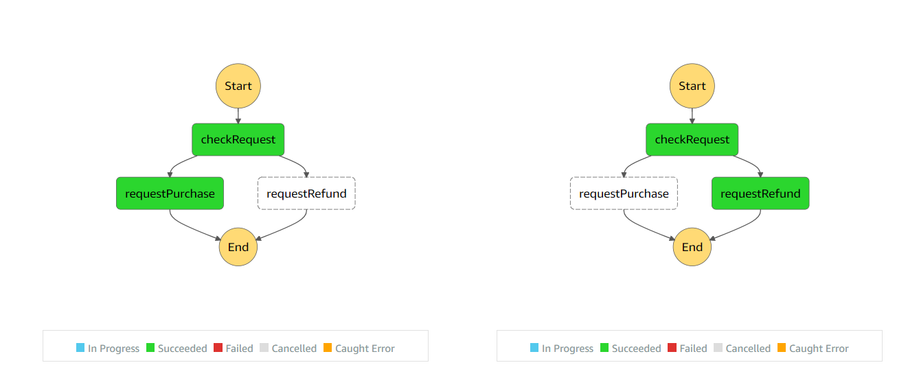

# Step Function

[](https://github.com/romarcablao)
[](https://linkedin.com/in/romarcablao)

A simple step function using serverless framework


```bash
# install plugin
serverless plugin install -n serverless-step-functions

# deploy
serverless deploy
```
